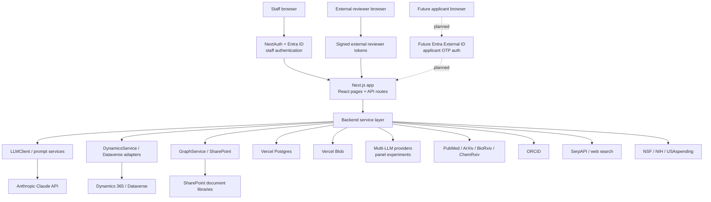
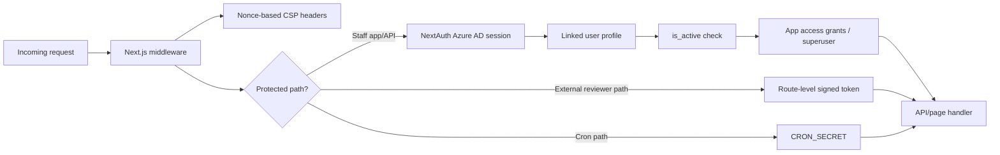
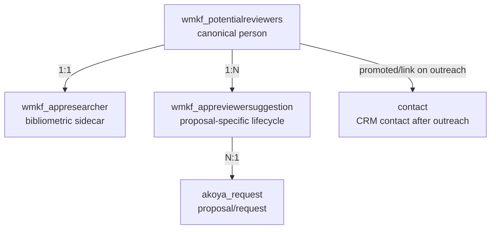
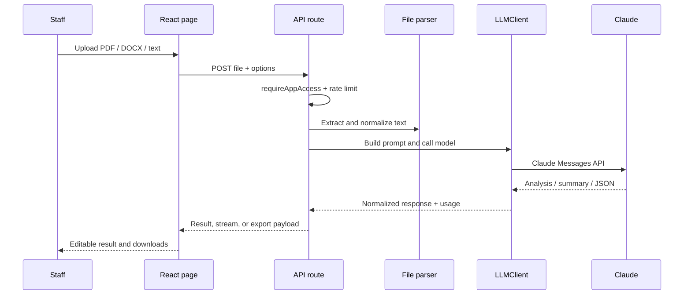
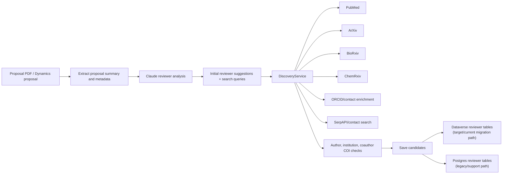
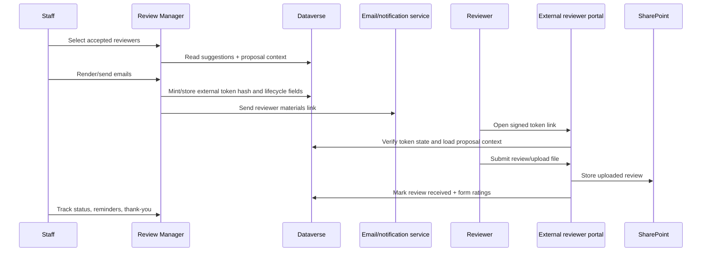
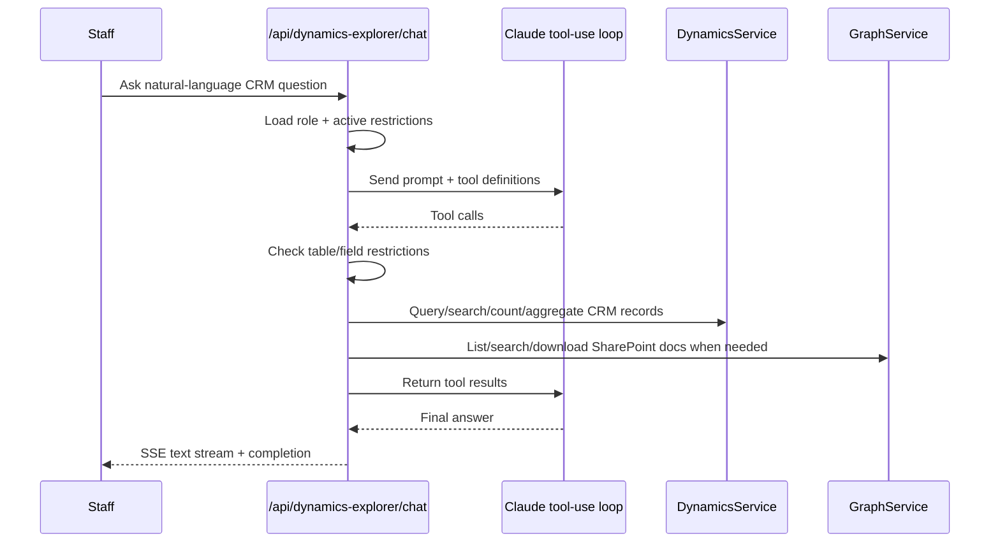
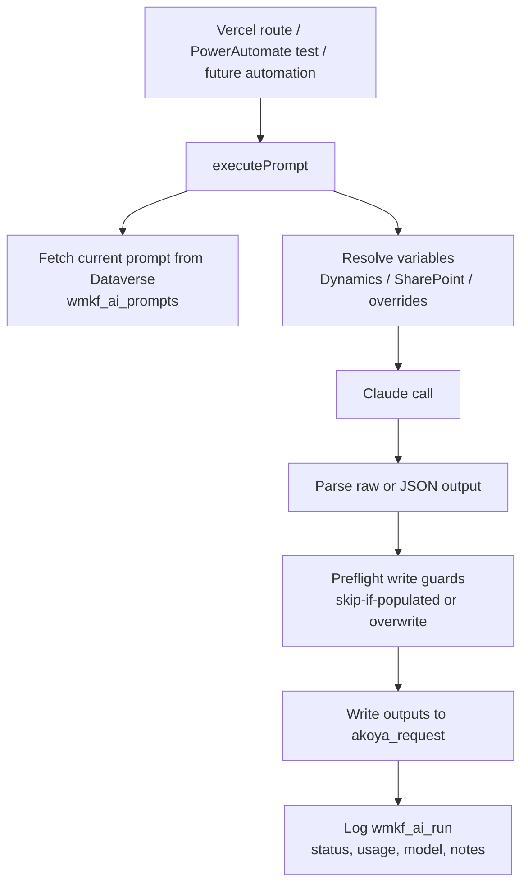
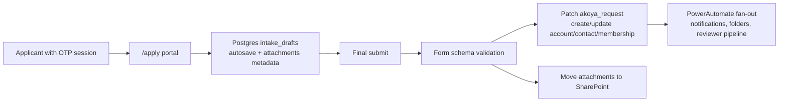

# Codebase Status and Architecture

**Prepared:** May 4, 2026  
**Repository:** `Phase-II-Summaries`  
**Audience:** WMKF staff, IT, and collaborators who need a clear picture of the work in progress

## Executive Summary

This codebase has evolved from a single Phase II proposal writeup generator into a multi-application research operations platform for the W.M. Keck Foundation. It now supports proposal summarization, reviewer discovery, review management, CRM exploration, integrity screening, grant reporting, multi-model review simulation, staff expertise matching, and the early foundation for a new applicant intake portal.

The system is a Next.js application deployed as serverless routes, with React pages on the frontend and API routes on the backend. The backend integrates with Claude, Microsoft Dynamics/Dataverse, Microsoft Graph/SharePoint, Vercel Postgres, Vercel Blob, literature APIs, federal funding APIs, ORCID, and SerpAPI. Staff access is protected by Microsoft Entra ID through NextAuth, app-level authorization, profile linkage, and server-side route guards.

At a high level, the platform is now split into three operating modes:

1. **Staff-facing AI tools** for summarizing, evaluating, searching, screening, and drafting.
2. **Operational workflow tools** that read/write Dynamics and SharePoint, especially around reviewers and grant reporting.
3. **Emerging platform infrastructure** for prompt execution, Dataverse migration, applicant intake, external reviewer intake, monitoring, and security hardening.

The biggest architectural shift underway is the movement from Vercel Postgres as the operational store for reviewer/workflow data toward Dataverse as the source of truth. Postgres remains important for local application state, preferences, logs, caches, draft staging, and reference data.

## Current Product Surface

The live application registry defines the staff-facing suite. Concept Evaluator has been archived, and the current registry contains the following tools:

| Area | Application | What it does |
|---|---|---|
| Proposal evaluation | Multi-Perspective Evaluator | Evaluates a proposal through optimistic, skeptical, and neutral AI perspectives, then synthesizes the result. |
| Summaries | Batch Phase I Summaries | Processes multiple Phase I proposal PDFs with configurable summary length and export. |
| Summaries | Batch Phase II Summaries | Processes multiple Phase II proposal PDFs with configurable summary length and export. |
| Summaries | Phase I Writeup | Generates standardized Phase I writeup drafts from uploaded PDFs. |
| Summaries | Phase II Writeup | Generates standardized Phase II writeup drafts and supports Q&A/refinement follow-up. |
| Funding analysis | Funding Analysis | Uses NSF, NIH, and USAspending data to assess funding landscapes and funding gaps. |
| Reviewer pipeline | Reviewer Finder | Finds and verifies qualified peer reviewers using AI plus PubMed, ArXiv, BioRxiv, ChemRxiv, ORCID, and web search. |
| Reviewer pipeline | Review Manager | Tracks accepted reviewers, sends/render emails, manages materials, reminders, tokens, uploads, and lifecycle status. |
| Reviewer pipeline | External Reviewer Portal | Public magic-link workflow for reviewers to access proposal context and upload structured reviews. |
| Review synthesis | Peer Review Summarizer | Summarizes peer review feedback, themes, concerns, and site visit questions. |
| Analysis | Literature Analyzer | Synthesizes research papers and academic literature. |
| Analysis | Applicant Integrity Screener | Screens applicants against Retraction Watch, PubPeer/news search, and AI summaries. |
| CRM | Dynamics Explorer | Lets staff ask natural language questions over Dynamics and SharePoint-backed documents through a tool-using AI agent. |
| Staff matching | WMKF Expertise | Matches proposals to internal staff, consultants, and board expertise. |
| Simulation | Virtual Review Panel | Runs a multi-LLM review panel with claim verification and synthesis. |
| Reporting | Grant Reporting | Extracts progress/final reports, compares goals versus achievements, looks up original grants, and exports Word reports. |
| Operations | Admin Console | Exposes health, alerts, model settings, secrets checks, maintenance, and identity reconciliation. |

## Codebase Shape

Current source inventory, excluding archived code and dependencies:

| Metric | Current count |
|---|---:|
| Source/code files | 363 |
| Approximate code lines | 99,799 |
| Staff/public pages | 28 |
| API route files | 76 |
| Service modules | 39 |
| Tests | 22 |
| Markdown docs | 92 |

Primary directories:

| Directory | Role |
|---|---|
| `pages/` | Next.js pages for staff tools, auth pages, and public external reviewer routes. |
| `pages/api/` | Serverless API endpoints for AI processing, Dynamics/Dataverse operations, reviewer workflows, admin, cron, uploads, and public token routes. |
| `lib/services/` | Backend service layer for Dynamics, Graph, AI clients, literature APIs, reviewer discovery, integrity screening, notifications, settings, maintenance, and workflow helpers. |
| `lib/dataverse/` | Dataverse client, schema application helpers, role application, and entity adapters. |
| `lib/utils/` | Auth, cron auth, security utilities, file parsing, PDF helpers, encryption, logging, Blob proxying, safe fetch, and health checks. |
| `shared/components/` | Shared React layout, auth/app guards, upload controls, profile UI, settings, and reusable modals. |
| `shared/config/` | App registry, model configuration, guide content, Keck guidelines, and prompt modules. |
| `shared/forms/` | Forms-as-code foundation for the planned applicant intake portal. |
| `tests/` | Unit and integration coverage for auth, security, tokens, review upload, Dynamics context, LLM client, and prompt utilities. |
| `docs/` | Architecture, security, migration, rollout, lifecycle, prompt, reviewer, and intake planning documents. |
| `scripts/` | Operational scripts for Dataverse schema work, smoke tests, backfills, probes, prompt seeding, and migration support. |

## Architecture Overview

The system is not a monolith in the traditional server sense; it is a Next.js/Vercel serverless application. The shared application shell handles authentication, profile context, and app access. Each product page calls one or more API routes. Those API routes enforce auth, rate limits, app access, input validation, and then delegate to service modules.

The service layer is the important architectural boundary. It keeps vendor-specific logic out of pages and centralizes hard problems like Claude retries, Dataverse restrictions, Graph downloads, usage logging, encryption, prompt resolution, reviewer matching, and search caching.

## Authentication and Authorization

Security controls currently in place include:

- Microsoft Entra ID staff sign-in via NextAuth.
- Middleware gate before pages load, with public exceptions for auth, external reviewer routes, and cron.
- Nonce-based Content Security Policy and `frame-ancestors 'none'`.
- API route helpers for authentication, profile linkage, app-level access, CSRF origin checks, and active-account checks.
- App-level access grants through `shared/config/appRegistry.js` and app access services.
- Superuser-only admin routes.
- Rate limiting on high-cost or sensitive API endpoints.
- `safeFetch` and the canonical `LLMClient` for SSRF allowlisting, timeouts, retries, redaction, and usage logging.
- Encrypted stored API keys and masked secret presentation.
- Public reviewer links use signed tokens, token hashes, expiry, revocation, and route-specific verification.

## Data Stores and Source-of-Truth Direction

```mermaid
flowchart TB
  Postgres["Vercel Postgres"]
  Dataverse["Dynamics / Dataverse"]
  Blob["Vercel Blob"]
  SharePoint["SharePoint"]

  Postgres --> P1["User profiles, preferences,<br/>app access, settings"]
  Postgres --> P2["Search caches and reference data"]
  Postgres --> P3["Usage logs, alerts, health history"]
  Postgres --> P4["Applicant draft staging<br/>(planned intake)"]

  Dataverse --> D1["Requests/proposals"]
  Dataverse --> D2["Contacts/accounts/staff identity"]
  Dataverse --> D3["Reviewer suggestions lifecycle"]
  Dataverse --> D4["AI prompt catalog and run logs"]
  Dataverse --> D5["Future applicant submission fields"]

  Blob --> B1["Uploaded/staged files and extracted artifacts"]
  SharePoint --> S1["Official proposal/report/reviewer materials"]
```

The strategic direction is clear:

- **Dataverse is becoming the operational source of truth** for grant records, reviewer suggestions, accepted reviewer lifecycle state, AI prompt records, and final applicant submissions.
- **Postgres remains the application support store** for profiles, access grants, user preferences, logs, caches, alerts, health, Retraction Watch/reference data, and temporary applicant drafts.
- **Blob is used for app-managed file staging and generated artifacts.**
- **SharePoint is the official document repository** for proposal materials, reviewer downloads, uploaded reviews, grant reports, and applicant attachments after submission.

The reviewer subsystem is the most visible transition area. Older Postgres tables model researchers, publications, and suggestions. New Dataverse adapters map the target model into:

## Main Data Flows

### 1. Staff AI document processing

This pattern covers the older proposal writeup generators, batch summaries, literature analysis, peer review summarization, expense extraction, grant reporting extraction, and parts of the virtual review panel.

### 2. Reviewer Finder

The reviewer workflow is one of the most mature product areas. It includes AI ranking, external publication verification, candidate deduplication, conflict-of-interest checks, contact enrichment, email generation, saved candidate lists, and a downstream Review Manager.

### 3. Review Manager and external reviewer intake

Review Manager now bridges staff operations, reviewer outreach, external reviewer access, token lifecycle, uploaded review storage, and structured review fields. It is Dataverse-backed for accepted suggestions and lifecycle state.

### 4. Dynamics Explorer

Dynamics Explorer is an agentic, server-side tool-use loop. The model does not receive raw credentials. The server executes approved tools, applies table/field restrictions, logs queries, truncates large results, and streams progress/results to the browser.

### 5. Prompt execution and backend automation

The `executePrompt` service is a Phase 0 backend automation layer. It formalizes prompt storage, variable resolution, guardrails, output parsing, Dataverse writes, and audit logging. This is a key bridge between the Vercel app and future PowerAutomate-managed grant cycle automations.

### 6. Applicant intake portal foundation

The intake portal is not yet a live app in the staff registry, but the design and first technical pieces are present:

- `docs/INTAKE_PORTAL_DESIGN.md` defines the pilot architecture.
- `docs/IT_ENTRA_EXTERNAL_TENANT_REQUEST_2026-05-04.md` documents the external identity tenant request.
- `shared/forms/phase-ii-research-2026-06/` contains the first forms-as-code schema, validator, and Dynamics mapper.
- `lib/services/intake-draft-service.js` implements Postgres-backed draft autosave/storage.

Planned flow:

The pilot target is the mid-June 2026 Phase II Research cycle. The main external blocker is provisioning a separate Entra External ID tenant for applicants.

## AI and Model Layer

The codebase has moved from scattered direct Claude calls toward a canonical AI layer:

- `lib/services/llm-client.js` wraps Anthropic Messages API calls.
- It supports unary and streaming calls, tool-use blocks, retry on 429/529, fallback models, timeouts, redaction, and usage logging.
- `shared/config/baseConfig.js` defines per-app model choices.
- `lib/services/model-override-loader.js` allows model overrides from configuration.
- Prompt modules live under `shared/config/prompts/`.
- Some prompts and executor-driven tasks now live in Dataverse as `wmkf_ai_prompts`.

The current default model configuration is centered on Claude Sonnet for most analytical tasks and Claude Haiku for cheaper/faster lower-complexity or tool-use tasks such as Dynamics Explorer. The virtual review panel also has a separate multi-LLM service path for panel-style experiments.

## Integrations

| Integration | Used for |
|---|---|
| Anthropic Claude | Summaries, analysis, extraction, tool-use CRM chat, reviewer reasoning, synthesis, prompt execution. |
| Microsoft Entra ID | Staff SSO through NextAuth; future external applicant identity via separate External ID tenant. |
| Dynamics 365 / Dataverse | Requests, contacts, accounts, reviewer lifecycle, AI prompt/run records, app access/settings migration path. |
| Microsoft Graph / SharePoint | Proposal documents, reviewer materials, grant reports, uploaded reviews, future applicant attachments. |
| Vercel Postgres | Profiles, access, settings, logs, caches, legacy reviewer data, integrity/reference data, intake drafts. |
| Vercel Blob | Uploaded/staged files, extracted summary artifacts, generated assets before promotion. |
| PubMed / NCBI | Reviewer verification and literature search. |
| ArXiv / BioRxiv / ChemRxiv | Reviewer discovery across preprint ecosystems. |
| ORCID | Researcher identity and profile enrichment. |
| SerpAPI | Contact enrichment, PubPeer/news search, web discovery. |
| NSF / NIH / USAspending | Federal funding gap analysis. |
| Retraction Watch / PubPeer | Integrity screening signals. |

## Testing and Quality Posture

The test suite is focused on the highest-risk shared infrastructure:

- Auth routes, auth policy, and cross-user isolation.
- Security headers, safe fetch, log redaction, file magic checks.
- External reviewer token lifecycle and verification.
- Review upload and reviewer materials behavior.
- Dynamics request context and caller ID behavior.
- LLM client behavior.
- Prompt utility behavior.

There is less coverage around full UI workflows and long-running AI routes, which is common for this stage of a tool-heavy internal platform but remains a risk area. The codebase relies heavily on smoke scripts for Dataverse, Graph, reviewer finder, form mapping, and migration verification.

## Operational Status

What appears solid:

- Staff authentication and app access architecture.
- App registry and common layout/navigation.
- Centralized LLM client and security utilities.
- Dynamics Explorer tool-use architecture.
- Reviewer Finder and Review Manager product depth.
- External reviewer token model.
- Dataverse schema/adapters for reviewer lifecycle.
- Security hardening documentation and tests.
- Admin/cron scaffolding for health, secrets, maintenance, spend, and identity reconciliation.

What is actively in transition:

- Reviewer data is moving from Postgres-centered storage to Dataverse-centered storage.
- Prompt storage is moving from static repo modules toward Dataverse-managed prompts for backend automation.
- Applicant intake is in design/early implementation rather than production.
- Some older API routes still use legacy/direct patterns while newer services converge on `LLMClient`, Dataverse adapters, and shared auth helpers.
- The original README understates the current system; this document and the broader `docs/` directory are more representative.

Main risks and open work:

- **Dataverse migration complexity:** dual models exist in parts of the reviewer stack.
- **Workflow ownership boundaries:** Vercel and PowerAutomate must remain clearly split, especially for grant cycle automations.
- **External identity dependency:** applicant portal depends on Entra External ID tenant provisioning.
- **Long-running AI routes:** several routes run up to five minutes and need continued monitoring for Vercel/runtime behavior, costs, and rate limits.
- **End-to-end test coverage:** critical shared utilities are covered, but product workflows would benefit from more integration/browser tests.
- **Documentation drift:** older docs still reference archived or previous-state tools, so organization-facing docs should be dated and treated as snapshots.

## Bottom Line

The platform is no longer just a document summarizer. It is becoming a research operations layer around Dynamics and SharePoint, with AI used as a workflow accelerator rather than a standalone novelty. The strongest current capabilities are proposal analysis, reviewer discovery/management, CRM exploration, integrity screening, grant reporting, and the growing Dataverse-backed workflow foundation.

The next strategic step is consolidation: finish the Dataverse cutover for reviewer data, continue centralizing AI calls and prompt execution, and bring the applicant intake pilot from design into a small, controlled production cycle.
