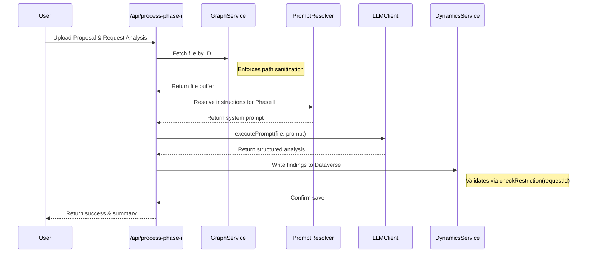

# Behavioral Flow Diagram (AI Pipeline)

This sequence diagram traces a concrete execution path (e.g., `/api/process-phase-i`), showing how services interact during an AI analysis task.

```mermaid
sequenceDiagram
    participant User
    participant API as /api/process-phase-i
    participant Graph as GraphService
    participant Prompt as PromptResolver
    participant LLM as LLMClient
    participant Dynamics as DynamicsService

    User->>API: Upload Proposal & Request Analysis
    API->>Graph: Fetch file by ID
    Note right of Graph: Enforces path sanitization
    Graph-->>API: Return file buffer
    
    API->>Prompt: Resolve instructions for Phase I
    Prompt-->>API: Return system prompt
    
    API->>LLM: executePrompt(file, prompt)
    LLM-->>API: Return structured analysis
    
    API->>Dynamics: Write findings to Dataverse
    Note right of Dynamics: Validates via checkRestriction(requestId)
    Dynamics-->>API: Confirm save
    
    API-->>User: Return success & summary
```
