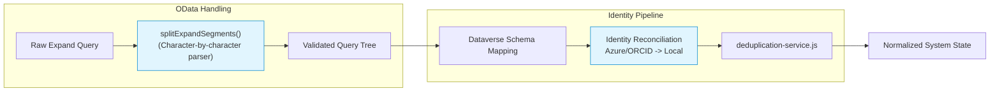

# Data Engine Diagram (OData & Reconciliation)

This pipeline visualization focuses on the internal data complexities, specifically the OData parser and identity merging required for Dataverse.

```mermaid
flowchart LR
    subgraph "OData Handling"
        Input[Raw Expand Query] --> SES["splitExpandSegments()\n(Character-by-character parser)"]
        SES --> Validated[Validated Query Tree]
    end

    subgraph "Identity Pipeline"
        Validated --> Map[Dataverse Schema Mapping]
        Map --> IR[Identity Reconciliation\nAzure/ORCID -> Local]
        IR --> Dedup[deduplication-service.js]
    end

    Dedup --> Output[Normalized System State]
    
    classDef logic fill:#e1f5fe,stroke:#0288d1;
    class SES,IR logic;
```
