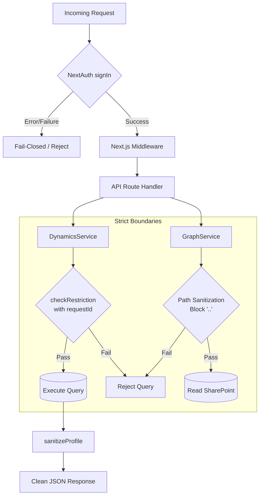

# Security Fortress & Identity Diagram

This flowchart demonstrates the "Fail-Closed" security architecture mandated by the project guidelines, highlighting the specific restriction scopes and sanitization methods.

