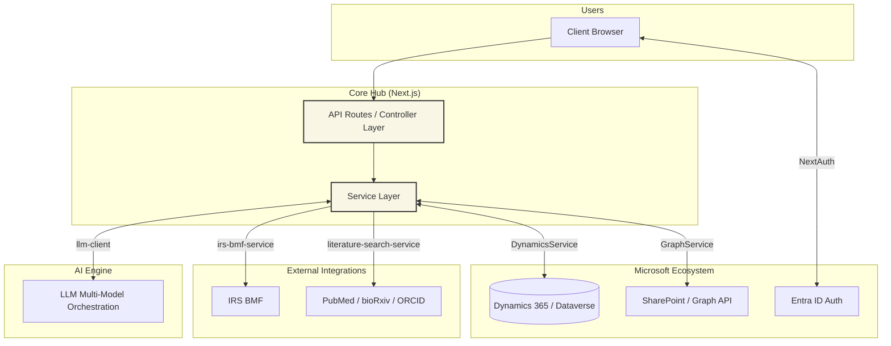

# System Landscape Diagram

This diagram illustrates the Next.js API acting as the central orchestration layer between the Microsoft ecosystem, external academic/government APIs, and the AI engine.

