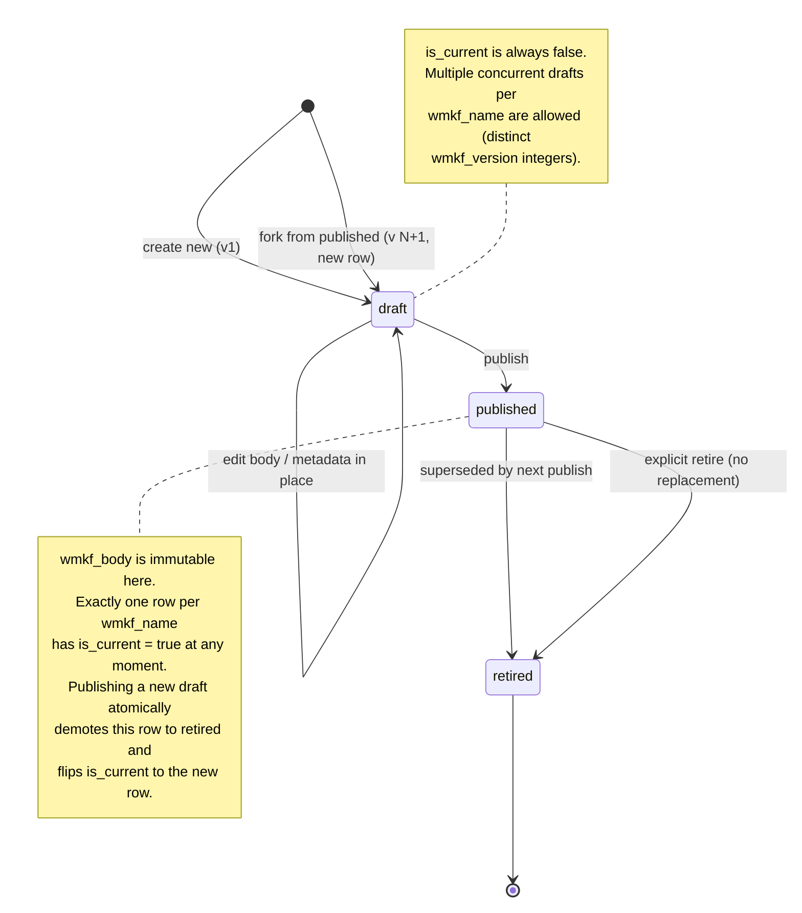
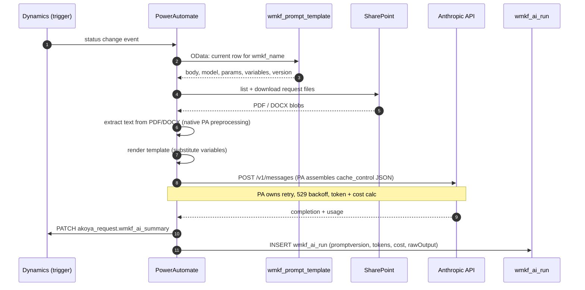
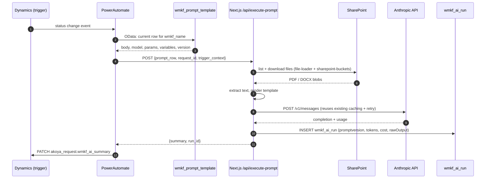

# Prompt Storage Design (In Progress)

**Status:** Design conversation started 2026-04-14 (Session 99), extended in Session 100. Not yet implemented.
**Owner:** Justin Gallivan
**Related docs:** `docs/BACKEND_AUTOMATION_PLAN.md`, `docs/DYNAMICS_AI_FIELDS_SPEC_v3_cn.md`, `docs/WORKFLOW_CHAINING_DESIGN.md`

> This doc is a live working draft. It exists so a browser Claude Code session can pick up the conceptual work visually (Mermaid diagrams, state machines, flow comparisons). Once decisions settle, it becomes the implementation spec.

---

## Guiding principles

Extracted from the Session 99–100 design conversations. These are the load-bearing ideas — if a feature or implementation choice conflicts with one of these, that's a signal to stop and reconsider.

1. **Dynamics is source of truth for PA-readable prompts.** `.js` stays canonical for Next.js-only prompts (Pattern B, Pattern C) until there's a concrete reason to move. Don't migrate for the sake of migrating.
2. **Transparency by default.** Every Vercel app that calls Claude shows the user the prompt it's about to use, collapsed by default. Users can always see what the model is doing.
3. **One prompt per analysis, not one prompt per app.** The "Vercel sibling vs. backend twin" duplication dissolves when callers pass structured inputs instead of raw PDFs. A single prompt row serves PA backend auto-drafts AND dual-caller interactive refinement.
4. **Preprocessing and caller-specific logic stay in the caller.** Dynamics stores static template text + declared variable slots. Callers do truncation, PDF extraction, conditional resolution, and output parsing.
5. **Safety is multi-tiered, not monolithic.** Draft/publish is one tier. Pre-publish structural lint is a second. Pre-publish test-run against a known input is a third. Fast rollback is a fourth. Each has a different build cost; ship in that order, don't skip the cheap tiers.
6. **Append-only, immutable audit.** A published version is frozen. Edits and rollbacks create new rows — never mutate an existing one. `wmkf_ai_run.wmkf_ai_promptversion` (+ `wmkf_prompt_override` for session overrides) is the authoritative provenance record.
7. **Ingest once, chain downstream.** The first call in a backend workflow reads the expensive input (proposal, attachments) and produces structured outputs. Downstream calls consume those outputs from Dynamics fields, not re-read the source. Token efficiency is a first-class design concern. See `WORKFLOW_CHAINING_DESIGN.md`.
8. **Compose infrastructure, not features.** A prompt resolver, an execute-with-body endpoint, and `wmkf_ai_run` logging form one infrastructure layer that serves: PA workflows, user overrides, superuser test runs, "promote override to draft," and the editor dashboard. Build once.
9. **Defer polish.** Justin-only editor for v1. No two-person review. No A/B testing or canary rollout. Three prompts, informed human in the loop, explicit publish gate. Add sophistication when scale or staffing demands it.

## Motivation

Today, Claude prompts live in `shared/config/prompts/*.js` as hard-coded JS templates. This works while all AI calls originate from Next.js apps running on Vercel. It breaks as soon as **PowerAutomate-triggered backend jobs** start composing their own Claude calls on status-change events in Dynamics — PA can't import JS modules from a Vercel deployment.

We need prompts to live somewhere that:
1. **PowerAutomate can read natively** (Dataverse, or an HTTP endpoint, or both)
2. **Next.js apps can continue to read** (same text, no drift)
3. **Can be viewed by staff** — a dashboard where all authenticated users can inspect the current prompt for any app
4. **Can be edited by privileged users** without a code deploy
5. **Has immutable version history** so `wmkf_ai_run.wmkf_ai_promptversion` continues to mean exactly what it says six months from now

## Decisions already locked in

These came out of the design conversation in Session 99. Listed here so a fresh agent session doesn't re-litigate them:

1. **Storage location: Microsoft Dynamics / Dataverse.** A new table, `wmkf_prompt_template`, is the single source of truth for both PA and Next.js.
2. **PowerAutomate composes Claude calls itself** (not dumb-trigger Next.js). This is the reason Dynamics storage wins over Postgres — PA reads Dataverse natively.
3. **Next.js reads the same Dynamics table** via OData, with aggressive in-process cache (5-min TTL pattern, same as `user_app_access`) and a git-backed seed file as fallback for outages.
4. **Append-only versions.** A published version is immutable. Any edit produces a new version row. Never mutate a published `wmkf_body`.
5. **Draft / publish flow.** Edits create a `status=draft` row. An explicit publish step transitions it to `status=published` and swaps the `is_current` pointer. Old `published` versions stay queryable as `status=retired`.
6. **Dashboard access model:**
   - All authenticated users: view any prompt, any version, with diff against previous
   - Superusers only: create drafts, edit drafts, publish drafts, retire published versions
7. **Git-seed stays committed.** Canonical bootstrap copies live in the repo for disaster recovery and new-environment setup. Dynamics is source of truth; git is backup.
8. **Dynamics ≠ AkoyaGO.** Storing prompts in `wmkf_prompt_template` is consistent with "minimize reliance on AkoyaGO" — Dynamics is the underlying platform, which we're already committed to.
9. **App patterns define which prompts need Dynamics storage.** Four migration-relevant patterns exist across the current app suite (see "App patterns and inventory" below). Only Pattern A and dual-caller prompts require Dynamics storage — Pattern B and C prompts have no PA driver and can stay in `.js` indefinitely.
10. **Retirements.** Concept Evaluator is deprecated (concepts workflow being retired). Batch Phase I Summaries and Batch Phase II Summaries Vercel UIs retire once the backend can loop over the underlying per-proposal prompt — the batch apps only existed because programmatic Dynamics access didn't yet, and they share their prompts with the single-writeup apps. Multi-Perspective Evaluator is a development playground, explicitly out of migration scope.
11. **Phase I/II writeup apps become dual-caller.** Backend PA auto-drafts on status change and writes to `akoya_request.wmkf_ai_summary`. The Vercel app becomes an interactive refinement surface (Q&A against the draft, optional writeback to the same field). Both PA and Next.js read the same prompt row.
12. **v1 scope is three prompt rows.** `phase-i-writeup`, `phase-ii-writeup`, `compliance-field-set-c`. Everything else (Pattern B/C prompts, Q&A prompts, shared fragments, non-dev editor UI) is v2+.
13. **Preprocessing stays in the caller.** Text truncation, PDF/DOCX extraction, chunking, cleaning, and conditional-branch resolution are caller-side logic in both PA and Next.js. Dynamics stores static template text + `wmkf_variables` declarations — callers compute final substitution values (including pre-resolved conditional blocks) before filling slots.
14. **Q&A sub-prompts stay in `.js` for v1.** Called only from Next.js (interactive writeup sessions); no PA driver. Re-evaluate in v2 once the dual-caller pattern is proven.
15. **Defensive extraction is caller-specific, not prompt-specific.** Current Vercel prompts are roughly 70% shared analytical core + 20% defensive extraction (institution/PI/amount/period from raw PDF) + 10% input. Target prompts drop most of the 20% because Dynamics-sourced callers pass those fields as known variables. This is what makes one prompt row per analysis viable — the "Vercel sibling with defensive extraction vs. backend twin with structured inputs" split dissolves in the target state.
16. **User-facing prompt visibility is universal for Vercel apps.** Every Vercel Claude-calling app displays the prompt it's about to run in a collapsed panel, expandable by any authenticated user. Fetched via a **prompt resolver** abstraction (`/api/prompts/[app-key]/current`) that transparently reads from Dynamics (Pattern A + dual-caller) or from the `.js` export (Pattern B + C). One interface, pattern-aware storage.
17. **Per-session user overrides are supported.** Any user can expand the prompt, edit it, and run with the modified version. The canonical Dynamics row is unchanged. `wmkf_ai_run` logs the full override text verbatim so provenance stays complete ("what exactly was sent to Claude"). Universal-edit with a "restore default" button is preferred over per-app opt-in — transparency trumps guard-rails.
18. **Editor safety is multi-tiered.** Beyond draft/publish: (a) pre-publish structural lint — every declared variable appears in the body and vice versa, braces balanced, model ID valid; (b) pre-publish test-run — superuser runs the draft against a pinned sample input and inspects the output (ideally side-by-side with current published output). The publish button is gated on both.
19. **Rollback appends, does not mutate.** Reverting from v4 to v3's body creates a new published v5 whose body is a copy of v3. v4 transitions to `retired` normally. Retired rows never come back to life — the append-only invariant stays intact, the audit log reads cleanly ("v5 was a rollback from v4 to v3's body"), and `wmkf_ai_run.wmkf_ai_promptversion` never points at an ambiguous row.
20. **Prompts declare their structured outputs.** A new `wmkf_output_schema` column defines what fields a prompt produces and where they persist in Dynamics. This enables workflow chaining — see `WORKFLOW_CHAINING_DESIGN.md`.
21. **Ingest-once principle.** For Pattern A workflows, the first Claude call reads the full proposal and produces structured outputs covering everything downstream steps need. Downstream calls consume those outputs from Dynamics fields. Phase I writeup becomes the canonical "ingest" prompt — not just "write a summary" but "extract the prose summary AND keywords AND methodologies AND risk flags AND team info in one call."
22. **Infrastructure composes across features.** The prompt resolver + execute-with-body endpoint + `wmkf_ai_run` logging serves: PA workflows, user overrides, superuser test runs, "promote override to draft," and dashboard previews. Building these primitives once unlocks all of them.

## App patterns and inventory

Four migration-relevant patterns across the current app suite:

- **Pattern A — Backend-primary, Vercel-as-reader.** PA/Dynamics runs the analysis on a trigger (typically a status change). Output lives in Dynamics fields. The Vercel app is a styled reader: it queries Dynamics and displays results, with no Claude call on the Vercel side.
- **Pattern B — Vercel-primary, Dynamics-as-source.** User triggers from Vercel. The app pulls structured context from Dynamics rather than asking the user to provide it or re-extract it from a PDF. Claude runs in Next.js. Output is a downloadable artifact (Word doc, `.eml`, markdown, PDF) — not persisted back to Dynamics.
- **Pattern C — Vercel-primary, user-uploaded input.** User uploads documents not stored in Dynamics (external reviews, arbitrary papers, receipts). Input is genuinely unstructured, so defensive extraction in the prompt is still warranted. Claude runs in Next.js. Output is a downloadable artifact.
- **Dual-caller (Pattern A + Vercel interactive).** One prompt row is read by both PA (auto-draft on trigger) and Next.js (user interactive refinement). Both write `wmkf_ai_run` rows with the same `wmkf_ai_promptversion` value — provenance is visible in the audit log ("auto-drafted by PA on Monday, refined by user via Q&A on Tuesday, saved over v1"). An interactive session should pin the prompt version it started with so a mid-session republish doesn't cause drift between the draft and subsequent Q&A turns.

### Inventory (post-migration state)

| App | Pattern | Dynamics prompt row? | Notes |
|---|---|---|---|
| Phase I Writeup (single) | Dual-caller | Yes (v1) | Backend auto-drafts; Vercel adds Q&A + optional save |
| Phase II Writeup (single) | Dual-caller | Yes (v1) | Same as above |
| Batch Phase I Summaries | Pattern A (backend loop) | Shared with Phase I Writeup | Vercel UI retired — backend loops the single-writeup prompt |
| Batch Phase II Summaries | Pattern A (backend loop) | Shared with Phase II Writeup | Vercel UI retired — same logic |
| Compliance / Field Set C | Pattern A | Yes (v1) | Backend-only |
| Phase I Dynamics (Test) | Pattern A (prototype) | Already the prototype | Becomes production Phase I auto-draft; source of `phase-i-writeup` prompt row |
| Concept Evaluator | Deprecated | No | Concepts workflow retired |
| Multi-Perspective Evaluator | Playground | No | Out of scope |
| Literature Analyzer | Pattern C | No — stays in `.js` | Not fully formed; no backend access planned |
| Peer Review Summarizer | Pattern C | No — stays in `.js` | External reviews, user-uploaded |
| Expense Reporter | Pattern C | No — stays in `.js` | User-uploaded receipts |
| Grant Reporting | Pattern B | Possibly (v2+) for editability | Stays in `.js` for v1 |
| Reviewer Finder | Pattern B | Possibly (v2+) for editability | Stays in `.js` for v1 |
| Review Manager | Pattern B | Possibly (v2+) for editability | Stays in `.js` for v1 |
| Expertise Finder | Pattern B | Possibly (v2+) for editability | Stays in `.js` for v1 |
| Funding Gap Analyzer | Pattern B | Possibly (v2+) for editability | Stays in `.js` for v1 |
| Integrity Screener (applicant) | Pattern B | Possibly (v2+) for editability | Distinct from Field Set C which is Pattern A |
| Dynamics Explorer | Pattern B (chat) | Probably not — ephemeral system prompts | — |
| Phase I/II writeup Q&A | Next.js-only | Deferred to v2 | No PA driver |

### Anatomy of a current Vercel prompt

Using `shared/config/prompts/phase-i-writeup.js` as the worked example. A Claude call in the current codebase is built in six layers; three of them move to Dynamics, three stay in caller code.

| Layer | Moves to `wmkf_prompt_template`? | Notes |
|---|---|---|
| Model selection (`getModelForApp`) | Yes — `wmkf_model` | Current fallback chain (DB override → env var → `baseConfig.js`) is superseded by reading Dynamics |
| Request parameters (max_tokens, temperature) | Yes — `wmkf_maxtokens`, `wmkf_temperature` | — |
| Static template body | Yes — `wmkf_body` | The ~70% analytical core |
| Variable slot declarations | Yes — `wmkf_variables` (JSON) | Named slots, descriptions, types |
| Conditional branches in prompt text | **No** — pre-resolved by caller | Caller builds the final string for the slot (e.g., "institution known" vs "institution unknown" block) and fills a single variable |
| Preprocessing (truncation, PDF extraction, chunking) | No — caller code | Depends on runtime input; Dynamics can record limits (e.g., `wmkf_max_input_chars`) but not execute them |
| HTTP envelope (`fetch` call, headers) | No — caller code | PA or Next.js |
| Response handling + `wmkf_ai_run` logging | No — caller code | Whoever makes the Anthropic call writes the run row |

### Current vs. target prompt shape

Phase I Writeup today, decomposed:

- **~70% shared analytical core** — role framing, output structure, section rules (Summary = 150-200 words, 4 rationale bullets, etc.), tone/forbidden words, formatting, output example. Carries across PA and Next.js identically.
- **~20% defensive extraction** — "You MUST extract the COMPLETE institution name," validation rules, error examples (Arizona vs. Arizona State, MIT vs. Massachusetts Institute of Technology), PI identification instructions. **Mostly disappears in the target state** because structured callers pass `institution`, `pi_name`, etc. as known variables.
- **~10% input block** — the truncated proposal text (100k char cap).

The target prompt row in Dynamics ≈ analytical core + structured-variable slots. The migrated Vercel dual-caller path adapts by sourcing those variables from Dynamics lookups instead of PDF extraction.

## Schema sketch (draft)

Not final — naming and memo caps need to line up with Dataverse conventions and Connor's review.

### `wmkf_prompt_template` (new table)

| Column | Type | Notes |
|---|---|---|
| `wmkf_name` | Text (natural key) | e.g. `phase-i-writeup`, `phase-ii-writeup`, `compliance-field-set-c` |
| `wmkf_version` | Integer | Append-only. Never reused. |
| `wmkf_body` | Memo | **Must raise cap from default 2000** — same pattern as `wmkf_ai_run.rawOutput` which Connor raised to 1,000,000. Some prompts (Phase I) run 5-8k chars. |
| `wmkf_model` | Text | e.g. `claude-sonnet-4-6` |
| `wmkf_maxtokens` | Integer | |
| `wmkf_temperature` | Decimal | |
| `wmkf_status` | Choice | `draft` \| `published` \| `retired` |
| `wmkf_is_current` | Bool | True for exactly one `published` row per `wmkf_name` |
| `wmkf_variables` | Memo (JSON) | Declared template slots + descriptions. Entries may include `{source: "akoya_request.wmkf_keywords"}` when the slot is sourced from an upstream prompt output (see `WORKFLOW_CHAINING_DESIGN.md`). |
| `wmkf_output_schema` | Memo (JSON) | **New.** Declared structured outputs — field names, types, descriptions, target Dynamics columns. Enables workflow chaining and dashboard preview. |
| `wmkf_preflight_passed_at` | DateTime (nullable) | **New.** Last time pre-publish lint ran clean on this row. Publish button reads this. |
| `wmkf_last_test_run_at` | DateTime (nullable) | **New.** Last time superuser test-ran this draft. Publish button reads this. |
| `wmkf_rollback_from_version` | Integer (nullable) | **New.** When a published row is itself a rollback, this records which retired version it restored. Read in the audit UI. |
| `wmkf_notes` | Memo | Per-version change-log blurb |
| `created_by` | Lookup (systemuser) | |
| `created_on` | DateTime | |
| `published_on` | DateTime | Null while draft |

### `wmkf_ai_run` additions

The run log already exists (Connor's side). Three additions for override and provenance tracking:

| Column | Type | Notes |
|---|---|---|
| `wmkf_ai_promptversion` | Integer | Existing. Points at the base version the call started from, even when overridden. |
| `wmkf_prompt_override` | Memo (nullable) | **New.** Full override text if the user modified the prompt for this run. NULL if the call used the published body unmodified. Same memo cap as `wmkf_body`. |
| `wmkf_prompt_was_overridden` | Bool | **New.** Denormalized flag for fast filtering ("show me all runs that used overrides"). |
| `wmkf_run_source` | Choice | **New.** `pa-auto` \| `vercel-user` \| `vercel-test-run` \| `vercel-interactive`. Distinguishes PA auto-drafts from user overrides from superuser test-runs, which is necessary for cost attribution and eval filtering. |

## What PowerAutomate inherits by composing Claude calls itself

Today these live in Next.js services. Once PA composes, PA owns them (or delegates back via a helper endpoint):

- **PDF/DOCX text extraction** — `lib/utils/file-loader.js` on the Vercel side. PA has its own PDF preprocessing capability, so both callers can handle extraction independently — no cross-boundary helper needed.
- **Anthropic retry / backoff on 529s and rate limits.** PA has built-in retry but it's coarse; needs per-flow configuration.
- **Prompt caching with `cache_control` markers.** Doable in PA's HTTP action but the JSON assembly is ugly. We use ephemeral cache today — material cost savings.
- **Token counting + cost estimation.**
- **Logging to `wmkf_ai_run`.** PA can do this natively (it's the same Dataverse table it already writes to), so this one is easy.

With PDF extraction solved natively in PA, the remaining items (retry, caching, token counting) are still weighty enough that **hybrid composition** (PA fetches + renders the prompt from Dynamics, then POSTs the rendered prompt to a thin Next.js `/api/execute-prompt` endpoint that handles the Claude mechanics) is still worth weighing against full composition — but the gap has narrowed.

## User-facing prompt features

Two related features that fall out of the "transparency by default" principle. They share infrastructure and should be designed together.

### Visibility (universal, read-only)

Every Vercel app that calls Claude shows the prompt it's about to use in a panel that's collapsed by default and expandable by any authenticated user.

- The panel renders the resolved current prompt for the app, fetched at page load via `/api/prompts/[app-key]/current`.
- Two display modes via toggle:
  - **Raw template** (default) — shows `{{variable}}` slots unfilled. Cleaner, exposes prompt structure, suitable for editing.
  - **Rendered** — shows substituted values. Reveals exactly what Claude will see. More verbose but useful for debugging.
- **Pattern A readers** (no Claude call on Vercel — pure display of a PA-generated draft) show the *historical* prompt that produced the displayed output, looked up via the `wmkf_ai_promptversion` on the run row. Read-only by construction.

### Editability (universal, per-session)

When the panel is expanded, any user can edit the body and run with their override.

- The override exists only for the current run. The next page load reverts to the published default. (No persistent personal libraries in v1.)
- Submission sends `{prompt_body_override, input_variables}` to the existing API endpoint. The endpoint runs Claude with the override instead of fetching from Dynamics.
- `wmkf_ai_run` records the full override text in `wmkf_prompt_override` and flips `wmkf_prompt_was_overridden = true`. Provenance never breaks.
- A "Restore default" button is always present.
- A future "Promote to draft" button (deferred to v2) packages an override into a new `wmkf_prompt_template` draft row for superuser publish review. Gives users a path from "I tweaked this and it's better" to "this should become canonical."

### The prompt resolver abstraction

Every Vercel API route that calls Claude already does prompt assembly. The resolver standardizes where the body comes from:

```
GET  /api/prompts/[app-key]/current
  → { body, variables, output_schema, model, max_tokens, temperature, version, source }
  source is "dynamics" or "js" — pattern-aware, but transparent to consumers

POST /api/prompts/[app-key]/render
  body: { variables: {...} }
  → fully-rendered prompt string

POST /api/prompts/execute
  body: { app_key, variables, prompt_body_override?, run_source }
  → calls Claude, logs to wmkf_ai_run, returns { output, run_id }
```

Why this matters:
- Pattern B/C apps don't need to migrate to Dynamics just to get visibility/editability — the resolver reads from `.js` for them.
- The visibility feature is a single React component that consumes `/api/prompts/[app-key]/current`. Build once, mount in every app.
- The user-override feature reuses `/api/prompts/execute` with `prompt_body_override` populated.
- Superuser test-runs (next section) are the same call with `run_source: "vercel-test-run"`.
- "Promote to draft" is a separate write, not a new execution path.

### Side effects worth naming

- **Prompt caching breaks for overrides.** Anthropic's `cache_control` works on stable prefixes; any user edit before the marker invalidates the cache. Fine for an experimenting user — they accept the cost — but worth knowing for accounting.
- **Override content is user-supplied text in the system prompt.** A hostile user could attempt prompt injection against themselves. It's their session, their risk; not a blocker, but the editor should not allow saving/persisting overrides without the dual review path.
- **Pattern A readers expose historical prompts.** Looking up `wmkf_ai_promptversion` and rendering the body of a `retired` row is supported by the schema. The reader UI just needs to know to follow that path instead of asking for `is_current = true`.

## Editor safety: lint, test-run, rollback

The draft/publish flow (decision #5) is the first safety tier. Three more, in increasing build cost:

### Tier 2: Pre-publish structural lint (cheap)

Server-side check on a draft row before the publish button is enabled. Writes `wmkf_preflight_passed_at` on success.

- Every name in `wmkf_variables` appears at least once in `wmkf_body`
- Every `{{slot}}` in `wmkf_body` is declared in `wmkf_variables` (catches typos like `{{pi_nmae}}`)
- Body is non-empty, braces balanced, model ID resolves, `max_tokens` is within Anthropic's allowed range
- (Optional) body length didn't drop more than 50% since the last published version — warn, don't block
- (Optional) `wmkf_output_schema` is valid JSON if present, declared output fields don't collide

Half a day of work. Catches the dumb mistakes.

### Tier 3: Pre-publish test-run (the key addition)

Superuser runs the draft against a known input and inspects the output. Writes `wmkf_last_test_run_at` on completion.

- One or two **pinned test inputs** per prompt (e.g., a known `akoya_request` ID for Phase I writeup with well-understood expected output)
- "Run test" button on the draft editor invokes `/api/prompts/execute` with `prompt_body_override = draft.wmkf_body, run_source = "vercel-test-run"`
- Output rendered next to the current published prompt's output for the same input (run both — yes, this doubles the cost per test click, worth it for the prompts we care about)
- Superuser eyeballs side-by-side, decides to publish or iterate

Reuses the prompt resolver and execute-prompt infrastructure from the user-override feature. **The test-run is architecturally identical to a user override — only the audit `run_source` differs.**

The publish button is gated on `wmkf_preflight_passed_at IS NOT NULL` AND `wmkf_last_test_run_at IS NOT NULL` for the current `wmkf_version`.

### Tier 4: Fast rollback (mechanical, append-only)

If a published version is bad, restore the previous body in one click without breaking the append-only invariant.

Mechanics:
- Read `wmkf_body` from the most recent retired row (or whichever target version is selected)
- Create a new `wmkf_prompt_template` row with that body, `wmkf_version = current_max + 1`, `status = draft`
- Auto-populate `wmkf_notes` ("rollback to v3 from v4 — see incident log") and `wmkf_rollback_from_version = 3`
- Lint and test-run can be skipped (the body was previously validated by virtue of having been published) — fast-track publish
- Result: v5 is published, v4 is retired, v3 stays retired. Audit reads "v5 = rollback to v3."

### Two-person review — explicitly deferred

A `wmkf_approved_by` (Lookup, nullable) field is sketched but unused in v1. The lint + test-run + small user pool combination is sufficient. Add the gating logic when team size or stakes change.

### Editor UI shape this implies

The "first non-Justin editor" question (Q3 below) crystallizes into a specific build:

- **Draft editor** — textarea with variable highlighting
- **Validation panel** — live linter output
- **Test-run panel** — pick a pinned input, run draft (+ optionally current published for side-by-side), view output
- **Diff panel** — body diff vs. current published, with `wmkf_notes` editor
- **Publish button** — disabled unless the gating columns above are populated for this version
- **Rollback button** — visible on retired rows, opens the fast-track flow

Probably 2–3 days of build for a competent React engineer. Materially more than "plain textarea + publish button," materially less than a polished Prompt Studio.

## Workflow chaining and structured outputs

The token-efficiency principle (#7 above) has its own design doc — see `WORKFLOW_CHAINING_DESIGN.md`. The intersection with this doc is two columns and one design assumption:

- `wmkf_prompt_template.wmkf_output_schema` (Memo, JSON) declares what structured fields a prompt produces and where they persist in Dynamics
- `wmkf_prompt_template.wmkf_variables` entries can include `{source: "akoya_request.wmkf_keywords"}` to express "this slot is filled by an upstream prompt's output, not a runtime input"
- The first call in a backend workflow (typically the writeup/ingest prompt) is multi-output by design — it produces everything downstream calls need so the proposal text is read once per lifecycle

The companion doc covers worked examples, prerequisite Dynamics fields on `akoya_request` (Connor's domain), the three token-reduction techniques, and honest caveats about when chaining doesn't work.

## Four open questions

### 1. Template variable format

Prompts are templates with runtime slots (proposal text, grant context, file contents, etc.). What substitution syntax do we use?

- `{{var}}` — Handlebars / Liquid convention. Well-known, but PA's string substitution doesn't natively understand it.
- `{var}` — Python-style. Also foreign to PA.
- `$var` — Shell-style. Also foreign.
- **PA's native substitution** — `replace(variables('prompt'), '[[proposal_text]]', outputs('ExtractText'))` style.

PA's `replace()` action is delimiter-agnostic — it'll replace `[[x]]`, `{{x}}`, or `%x%` equally. So PA isn't picking for us; the question is what reads cleanly in the codebase, the editor, and the dashboard. Decision #13 (preprocessing + conditional resolution stays in the caller) means we don't need a template engine with conditionals — flat slot substitution is enough. Recommendation: **`{{var}}`** unless someone hits a concrete PA-side problem with it.

Still open pending a quick PA empirical check.

### 2. v1 scope — RESOLVED

**v1 is three prompt rows:** `phase-i-writeup`, `phase-ii-writeup`, `compliance-field-set-c`.

Rationale: these are the only prompts with a PA driver (the original motivation for moving out of `.js`). Phase I/II writeup rows are dual-caller — read by both PA auto-draft and Next.js interactive refinement. Compliance Field Set C is Pattern A backend-only. Batch Phase I/II Summaries share their prompts with the single-writeup apps (backend loops over the per-proposal prompt), so the batch apps contribute no new prompt rows.

See "App patterns and inventory" above for the full classification. Everything Pattern B, Pattern C, deprecated, or Q&A sub-prompt is explicitly v2+.

### 3. First non-Justin editor

The "Editor safety" section above now spec's the build: lint panel + test-run panel + diff panel + gated publish + rollback button. That's the **full editor**, ~2-3 days for a competent React engineer.

The remaining question is whether v1 ships with the full editor, or with a stripped-down "Justin uses a textarea, publishes via CLI" path while the editor is built in parallel:

- **Ship full editor in v1.** Connor or other superusers can edit on day one. Publish is gated on lint + test-run, so the safety story is real even for the first edit. Pushes v1 timeline.
- **Ship CLI/textarea for v1, full editor in v1.5.** Justin handles the first quarter of edits via Postgres-style direct writes (or a one-off script). Editor follows once the storage layer is proven. Faster v1.

Decision depends on whether anyone other than Justin needs to edit a prompt in the v1 timeframe. If yes, ship the editor with v1 — the safety tiers aren't optional for non-developer editors. If no, defer the editor.

### 4. Hybrid vs. full PA composition

- **Full composition:** PA fetches prompt → renders → POSTs to Anthropic directly → writes result to `akoya_request` + logs to `wmkf_ai_run`. Pure — no Next.js dependency at runtime.
- **Hybrid:** PA fetches prompt → renders → POSTs rendered prompt to Next.js `/api/execute-prompt` → Next.js handles Claude call, caching, retry, token counting, SharePoint file fetch, PDF extraction → returns result → PA writes to Dynamics.

Full composition is philosophically cleaner and removes Vercel as a runtime dependency for backend jobs. Hybrid is pragmatic — reuses everything we've already built.

Tentatively chose full composition in Session 99. The Session 100 additions push hard toward hybrid:
- **Multi-output prompts return JSON** that needs schema validation + retry on malformed output. Painful in PA, trivial in `claude-reviewer-service.js`.
- **Prompt resolver and execute-prompt endpoint already exist** for the user-override and superuser-test-run features. PA reusing them means one Claude codepath, not two.
- **`wmkf_ai_run` audit needs `wmkf_run_source`** to distinguish PA from Vercel calls — easier when both go through the same logging surface.

> **Update (2026-04-15):** Connor confirmed PA has a native PDF preprocessing capability, removing the PDF extraction dependency on Next.js. This was previously a strong argument for hybrid ("PA needs Next.js for extraction anyway"), so full composition is now more viable than before. The remaining hybrid arguments (JSON schema validation, retry, prompt caching, single codepath) still apply but the gap has narrowed. Decision still open pending Connor's input on the other PA-side concerns (retry complexity, `cache_control` assembly, timeout behavior).

Recommendation leans **hybrid** but full composition is a credible alternative now that PDF extraction is no longer a blocker.

---

## What to sketch

Diagrams that would help the human think:

1. ~~**Draft/publish state machine.**~~ Done — see "Sketches" below.
2. ~~**Full-composition vs. hybrid sequence diagrams, side by side.**~~ Done — see "Sketches" below.
3. **Data flow for a single backend trigger** (worked example: Phase I summary on a status change from "In Review" → "Needs AI Summary"). PA reads prompt, reads files from SharePoint, extracts text, calls Claude, writes `wmkf_ai_summary` + `wmkf_ai_run`.
4. **Dashboard UI wireframe.** List of prompts → detail view with version history → draft editor with lint + test-run + diff + publish gating. Doesn't need to be pretty — just "what's on the screen."
5. **Prompt resolver flow.** UI loads → fetch `/api/prompts/[app-key]/current` → display collapsed → user expands → optionally edits → submit calls `/api/prompts/execute` with `prompt_body_override` → response renders + `wmkf_ai_run` logs. Shows the unified surface across visibility, override, and test-run.
6. **Workflow chaining DAG.** Worked example for the Phase I lifecycle — see `WORKFLOW_CHAINING_DESIGN.md` for the rendered version.
7. **Editor UI wireframe.** Three panels: draft editor (left), validation + test-run output (right top), diff vs current published (right bottom). Publish button at top, gated on lint + test-run completion. Rollback affordance on retired version rows.

---

## Sketches (in progress)

Priorities 1 and 2 from the list above. Priorities 3 (worked-example data flow) and 4 (dashboard wireframe) still pending.

### 1. Draft / publish state machine



**Invariants the state machine enforces**

- `wmkf_body` is only mutable while `status = draft`. Published and retired rows are frozen.
- For each `wmkf_name`, at most one row has `is_current = true`, and that row has `status = published`.
- The publish transition is atomic: new row becomes `published` + `is_current = true`; prior `is_current` row becomes `retired` + `is_current = false`.
- `retired` is terminal. Rows stay queryable for historical `wmkf_ai_run.wmkf_ai_promptversion` references, but are never mutated or revived.

### 2. Full-composition vs. hybrid sequence

Same trigger in both: a Dynamics status change fires a PowerAutomate flow that needs to run a prompt for a specific `akoya_request`.

**Full composition** — PowerAutomate owns the Claude call end-to-end with no Next.js runtime dependency. PA handles PDF/DOCX text extraction natively.



**Hybrid composition** — PowerAutomate owns the trigger and the final write to `akoya_request`. Next.js owns the mechanics of making the Claude call work: file fetch, extraction, template render, caching, retry, cost tracking, `wmkf_ai_run` logging.



**What the diagrams make visible**

- Full composition is now fully self-contained — PA handles PDF/DOCX extraction natively (confirmed 2026-04-15), removing the last Next.js dependency. PA still has to implement `cache_control` JSON assembly, retry/backoff, and cost calculation, but the "no Vercel runtime dependency" argument is now genuine.
- Hybrid keeps every mechanic that already works in one tested codepath (`file-loader.js`, `claude-reviewer-service.js` retry, prompt caching) and adds exactly one cross-boundary POST. PA still fetches the prompt row itself, so `wmkf_ai_promptversion` provenance stays visible in PA's audit trail — that's the thing hybrid is careful not to give up.
- In both flows, `wmkf_ai_run` is written by whoever makes the Anthropic call. Logging lives next to the call, never on the trigger side. This matters because the rawOutput + token counts come back with the completion response.
- A "hybrid lite" variant exists (PA passes only `{prompt_name, request_id}` and lets Next.js fetch the prompt row too). That collapses PA's audit visibility back to just "I called Next.js," which is why the diagram above keeps the prompt fetch on PA's side.

---

## Out of scope for this design doc

- **Formal prompt eval / A-B testing.** The pre-publish test-run (Tier 3 above) gives an informed-human-eyeball check on a single pinned input. Statistical/historical-replay batch evaluation is covered separately in the broader batch evaluation tooling work.
- **Prompt library / shared fragments** (e.g. common grant-context preamble). Decision #15 + the structured-input target state mostly dissolves the duplication problem; revisit only if a real cross-prompt fragment emerges.
- **Persistent personal prompt libraries.** Per-session overrides only in v1; "save my favorite override" deferred.
- **"Promote override to draft" UI.** Sketched in Decision #17 / the editor section, but the actual submission flow is v2.
- **Two-person publish review** (`wmkf_approved_by`). Sketched but unused in v1.
- **Canary / gradual rollout of new prompt versions.** Publishes affect all live callers on next cache refresh. No traffic-splitting in v1.
- **Migrating Pattern B/C prompts to Dynamics.** The prompt resolver covers them via `.js` reads — migration is optional and only needed for non-dev editability. Revisit per app when there's a driver.
- **Specific Dynamics field additions on `akoya_request`** for chained workflow outputs — that's a schema exercise with Connor, scope-bounded by which downstream consumers exist.
