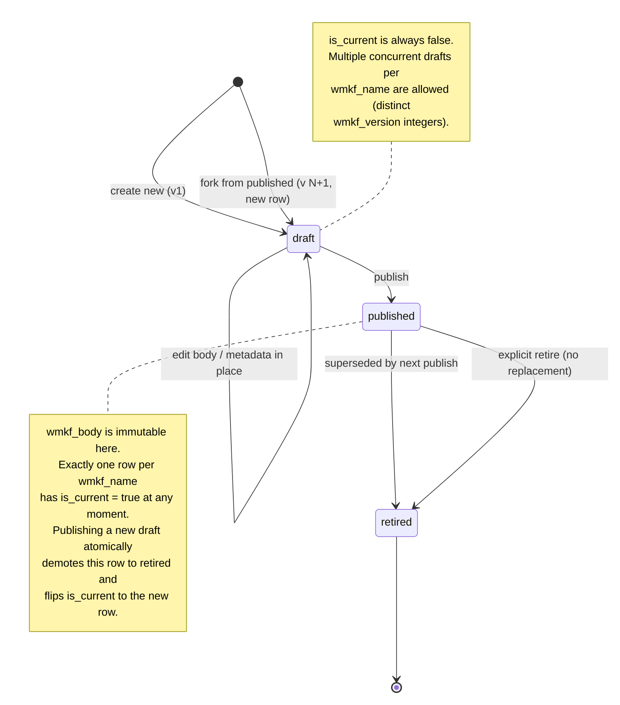
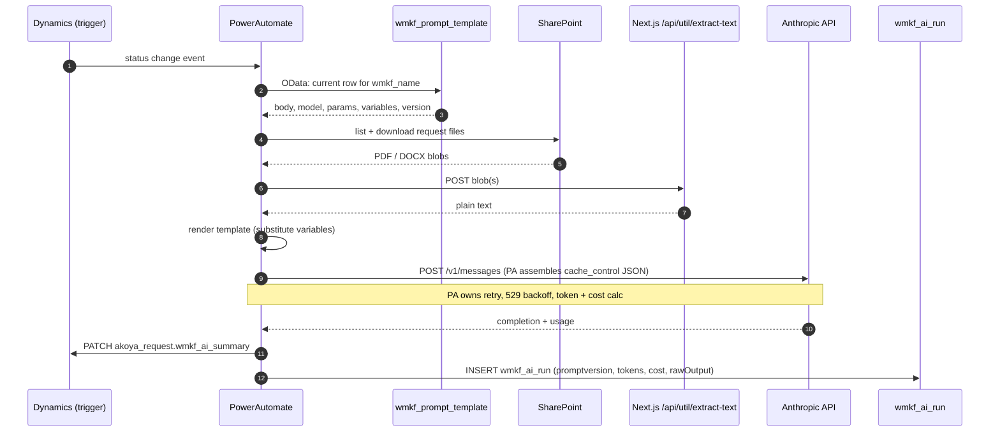
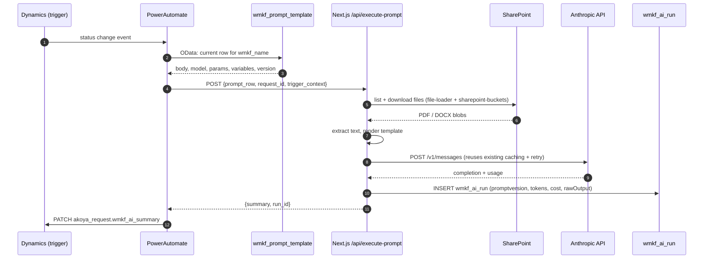

# Prompt Storage Design (In Progress)

**Status:** Design conversation started 2026-04-14 (Session 99). Not yet implemented.
**Owner:** Justin Gallivan
**Related docs:** `docs/BACKEND_AUTOMATION_PLAN.md`, `docs/DYNAMICS_AI_FIELDS_SPEC_v3_cn.md`

> This doc is a live working draft. It exists so a browser Claude Code session can pick up the conceptual work visually (Mermaid diagrams, state machines, flow comparisons). Once decisions settle, it becomes the implementation spec.

---

## Motivation

Today, Claude prompts live in `shared/config/prompts/*.js` as hard-coded JS templates. This works while all AI calls originate from Next.js apps running on Vercel. It breaks as soon as **PowerAutomate-triggered backend jobs** start composing their own Claude calls on status-change events in Dynamics — PA can't import JS modules from a Vercel deployment.

We need prompts to live somewhere that:
1. **PowerAutomate can read natively** (Dataverse, or an HTTP endpoint, or both)
2. **Next.js apps can continue to read** (same text, no drift)
3. **Can be viewed by staff** — a dashboard where all authenticated users can inspect the current prompt for any app
4. **Can be edited by privileged users** without a code deploy
5. **Has immutable version history** so `wmkf_ai_run.wmkf_ai_promptversion` continues to mean exactly what it says six months from now

## Decisions already locked in

These came out of the design conversation in Session 99. Listed here so a fresh agent session doesn't re-litigate them:

1. **Storage location: Microsoft Dynamics / Dataverse.** A new table, `wmkf_prompt_template`, is the single source of truth for both PA and Next.js.
2. **PowerAutomate composes Claude calls itself** (not dumb-trigger Next.js). This is the reason Dynamics storage wins over Postgres — PA reads Dataverse natively.
3. **Next.js reads the same Dynamics table** via OData, with aggressive in-process cache (5-min TTL pattern, same as `user_app_access`) and a git-backed seed file as fallback for outages.
4. **Append-only versions.** A published version is immutable. Any edit produces a new version row. Never mutate a published `wmkf_body`.
5. **Draft / publish flow.** Edits create a `status=draft` row. An explicit publish step transitions it to `status=published` and swaps the `is_current` pointer. Old `published` versions stay queryable as `status=retired`.
6. **Dashboard access model:**
   - All authenticated users: view any prompt, any version, with diff against previous
   - Superusers only: create drafts, edit drafts, publish drafts, retire published versions
7. **Git-seed stays committed.** Canonical bootstrap copies live in the repo for disaster recovery and new-environment setup. Dynamics is source of truth; git is backup.
8. **Dynamics ≠ AkoyaGO.** Storing prompts in `wmkf_prompt_template` is consistent with "minimize reliance on AkoyaGO" — Dynamics is the underlying platform, which we're already committed to.

## Schema sketch (draft)

Not final — naming and memo caps need to line up with Dataverse conventions and Connor's review.

| Column | Type | Notes |
|---|---|---|
| `wmkf_name` | Text (natural key) | e.g. `phase-i-summary`, `grant-reporting-goals`, `compliance-screen` |
| `wmkf_version` | Integer | Append-only. Never reused. |
| `wmkf_body` | Memo | **Must raise cap from default 2000** — same pattern as `wmkf_ai_run.rawOutput` which Connor raised to 1,000,000. Some prompts (Phase I) run 5-8k chars. |
| `wmkf_model` | Text | e.g. `claude-sonnet-4-6` |
| `wmkf_maxtokens` | Integer | |
| `wmkf_temperature` | Decimal | |
| `wmkf_status` | Choice | `draft` \| `published` \| `retired` |
| `wmkf_is_current` | Bool | True for exactly one `published` row per `wmkf_name` |
| `wmkf_variables` | Memo (JSON) | Declared template slots + descriptions, so PA and the dashboard know what to substitute |
| `wmkf_notes` | Memo | Per-version change-log blurb |
| `created_by` | Lookup (systemuser) | |
| `created_on` | DateTime | |
| `published_on` | DateTime | Null while draft |

## What PowerAutomate inherits by composing Claude calls itself

Today these live in Next.js services. Once PA composes, PA owns them (or delegates back via a helper endpoint):

- **PDF/DOCX text extraction** — `lib/utils/file-loader.js`. No clean Dataverse/PA connector for PDF text extraction; likely needs a thin Next.js `/api/util/extract-text` helper.
- **Anthropic retry / backoff on 529s and rate limits.** PA has built-in retry but it's coarse; needs per-flow configuration.
- **Prompt caching with `cache_control` markers.** Doable in PA's HTTP action but the JSON assembly is ugly. We use ephemeral cache today — material cost savings.
- **Token counting + cost estimation.**
- **Logging to `wmkf_ai_run`.** PA can do this natively (it's the same Dataverse table it already writes to), so this one is easy.

The weight of this list is why **hybrid composition** (PA fetches + renders the prompt from Dynamics, then POSTs the rendered prompt to a thin Next.js `/api/execute-prompt` endpoint that handles the Claude mechanics) is still worth weighing against full composition.

## Four open questions

### 1. Template variable format

Prompts are templates with runtime slots (proposal text, grant context, file contents, etc.). What substitution syntax do we use?

- `{{var}}` — Handlebars / Liquid convention. Well-known, but PA's string substitution doesn't natively understand it.
- `{var}` — Python-style. Also foreign to PA.
- `$var` — Shell-style. Also foreign.
- **PA's native substitution** — `replace(variables('prompt'), '[[proposal_text]]', outputs('ExtractText'))` style.

The tail wags the dog here: whatever PA can substitute cleanly is what we should use on both sides, even if it looks non-standard in the codebase. Need to test PA's `replace()` + string interpolation to pick.

### 2. v1 scope

Options:
- **Migrate all ~15 prompts now.** Forces every app onto the new store. Clean, but means touching every API route.
- **Migrate only PA-pipeline prompts first** (Phase I summary, Compliance — Field Set C). Minimum viable. Leaves the other ~13 prompts in JS modules until a reason surfaces to move them.

Leaning toward the second — incremental migration, prove the pattern on two prompts, then roll the rest when there's a trigger.

### 3. First non-Justin editor

If Connor (or anyone else) is going to edit prompts on day one, the dashboard needs:
- Variable-aware editor (highlights the declared `wmkf_variables`)
- Preview pane with sample substitution
- Diff view vs. last published version
- Maybe a linter for common issues (unbalanced braces, missing declared variables)

If it's Justin-only for the first quarter, a plain textarea + a "publish" button is enough.

Decides whether the dashboard is a half-day build or a multi-day build.

### 4. Hybrid vs. full PA composition

- **Full composition:** PA fetches prompt → renders → POSTs to Anthropic directly → writes result to `akoya_request` + logs to `wmkf_ai_run`. Pure — no Next.js dependency at runtime.
- **Hybrid:** PA fetches prompt → renders → POSTs rendered prompt to Next.js `/api/execute-prompt` → Next.js handles Claude call, caching, retry, token counting, SharePoint file fetch, PDF extraction → returns result → PA writes to Dynamics.

Full composition is philosophically cleaner and removes Vercel as a runtime dependency for backend jobs. Hybrid is pragmatic — reuses everything we've already built.

Tentatively chose full composition in Session 99. The "things PA inherits" list may push back toward hybrid.

---

## What to sketch

If you're a Claude Code session picking this up, these are the diagrams that would help the human think:

1. **Draft/publish state machine.** States: `draft → published → retired`. Show the `is_current` pointer swap when a new version publishes. Show that a draft can be edited in place (no new row) but a published version cannot (edits create a new draft).

2. **Full-composition vs. hybrid sequence diagrams, side by side.** Actors: `PowerAutomate`, `Dynamics`, `SharePoint`, `Anthropic API`, optionally `Next.js /api/execute-prompt`. Show every hop. This is how we'll actually compare them.

3. **Data flow for a single backend trigger** (worked example: Phase I summary on a status change from "In Review" → "Needs AI Summary"). PA reads prompt, reads files from SharePoint, extracts text, calls Claude, writes `wmkf_ai_summary` + `wmkf_ai_run`.

4. **Dashboard UI wireframe.** List of prompts → detail view with version history → draft editor. Doesn't need to be pretty — just "what's on the screen."

---

## Sketches (in progress)

Priorities 1 and 2 from the list above. Priorities 3 (worked-example data flow) and 4 (dashboard wireframe) still pending.

### 1. Draft / publish state machine

**Invariants the state machine enforces**

- `wmkf_body` is only mutable while `status = draft`. Published and retired rows are frozen.
- For each `wmkf_name`, at most one row has `is_current = true`, and that row has `status = published`.
- The publish transition is atomic: new row becomes `published` + `is_current = true`; prior `is_current` row becomes `retired` + `is_current = false`.
- `retired` is terminal. Rows stay queryable for historical `wmkf_ai_run.wmkf_ai_promptversion` references, but are never mutated or revived.

### 2. Full-composition vs. hybrid sequence

Same trigger in both: a Dynamics status change fires a PowerAutomate flow that needs to run a prompt for a specific `akoya_request`.

**Full composition** — PowerAutomate owns the Claude call end-to-end. Next.js survives only as a utility for PDF/DOCX text extraction, because no clean Dataverse/PA connector exists for that.

**Hybrid composition** — PowerAutomate owns the trigger and the final write to `akoya_request`. Next.js owns the mechanics of making the Claude call work: file fetch, extraction, template render, caching, retry, cost tracking, `wmkf_ai_run` logging.

**What the diagrams make visible**

- Full composition has one fewer network hop on the happy path (Anthropic ⇄ PA directly), but PA has to re-implement file extraction, `cache_control` JSON assembly, retry/backoff, and cost calculation. PDF extraction already requires a Next.js helper, which softens the "no Next.js runtime dependency" argument considerably.
- Hybrid keeps every mechanic that already works in one tested codepath (`file-loader.js`, `claude-reviewer-service.js` retry, prompt caching) and adds exactly one cross-boundary POST. PA still fetches the prompt row itself, so `wmkf_ai_promptversion` provenance stays visible in PA's audit trail — that's the thing hybrid is careful not to give up.
- In both flows, `wmkf_ai_run` is written by whoever makes the Anthropic call. Logging lives next to the call, never on the trigger side. This matters because the rawOutput + token counts come back with the completion response.
- A "hybrid lite" variant exists (PA passes only `{prompt_name, request_id}` and lets Next.js fetch the prompt row too). That collapses PA's audit visibility back to just "I called Next.js," which is why the diagram above keeps the prompt fetch on PA's side.

---

## Out of scope for this design doc

- Prompt eval / A-B testing (covered separately — the "historical replay" use case for batch evaluation tooling)
- Prompt library / shared fragments (e.g. common grant-context preamble) — worth discussing but deferring until v1 ships
- Migrating the other 13 prompts — in-scope for a follow-up once the pattern is proven on Phase I + Compliance
