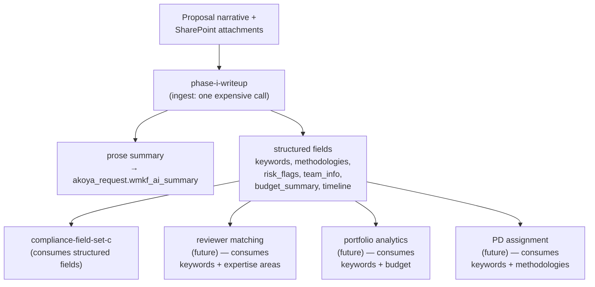

# Workflow Chaining & Token Efficiency (Design Principle)

**Status:** Design principle — extracted from Session 100 discussion of prompt storage migration.
**Owner:** Justin Gallivan
**Related docs:** `docs/PROMPT_STORAGE_DESIGN.md`, `docs/BACKEND_AUTOMATION_PLAN.md`, `docs/GRANT_CYCLE_LIFECYCLE.md`

> Companion to `PROMPT_STORAGE_DESIGN.md`. Storage is about *where prompts live*. This doc is about *how workflows use them* — specifically, how to pass data between steps without re-uploading the source document to Claude on every call.

---

## Principle

**A proposal should be read by Claude as few times as possible.** The first call that receives the full proposal text should extract everything downstream steps will need. Subsequent calls consume structured fields from Dynamics, not the original document.

This is a token-efficiency principle but also a design principle — it forces explicit thinking about what data a workflow produces and consumes, which makes PA flows easier to reason about.

## Three techniques that serve it

Distinct optimizations; naming them separately so we can apply them appropriately:

### 1. Multi-output consolidation in one call

Instead of splitting extraction into multiple Claude calls — Call 1 = summary, Call 2 = keywords, Call 3 = methodologies — ask a single call to return structured JSON with all the fields:

```json
{
  "prose_summary": "...",
  "keywords": ["..."],
  "methodologies": ["..."],
  "risk_flags": ["..."],
  "team_info": {},
  "budget_summary": "...",
  "timeline": "..."
}
```

**Trade-offs:**
- Pro: one call vs. several — saves re-uploads of the input
- Pro: forces an explicit extraction schema, which is good discipline
- Con: complex prompts can degrade the model's attention on individual fields. Not every task is a fit.
- Con: JSON reliability — Claude's JSON output is good but not perfect. Schema validation + malformed-JSON retry is necessary. PA's native JSON handling is brittle; this becomes an argument for hybrid composition.

### 2. Prompt caching (Anthropic `cache_control`)

Mark the stable prefix of a prompt with `cache_control`; Anthropic caches it and subsequent calls to the same prefix within TTL cost ~10% of the cached portion.

**Caveats for backend workflows:**
- Ephemeral cache TTL is ~5 minutes
- PA workflows frequently span more than 5 minutes between steps (human approval gates, scheduled runs, batch processing)
- Net: caching helps Vercel apps where calls cluster in a single user session. For PA flows, either design spatially-tight clusters or accept no cache benefit.

### 3. Intermediate data capture

**The structural fix, and the one we should design the backend around.** First expensive call persists structured outputs to Dynamics fields. Every downstream step reads those fields, not the proposal text.

## Worked example: Phase I proposal lifecycle



One call reads the proposal. Four or five downstream steps read structured fields instead. Rough savings for five downstream tasks on a 50k-token proposal: 5 × 50k = 250k input tokens collapses to 50k (ingest) + maybe 5 × 2k (downstream reads of structured fields). Order-of-magnitude win, and the downstream calls also complete faster.

## What this changes about prompt design

### Prompts declare their outputs

Today's Vercel prompts return unstructured markdown. Target-state Pattern A prompts should declare their structured outputs explicitly, so downstream callers and the dashboard know what fields they produce:

```json
// wmkf_prompt_template.wmkf_output_schema for phase-i-writeup
{
  "prose_summary": {
    "type": "markdown",
    "target": "akoya_request.wmkf_ai_summary",
    "description": "The 500-600 word Phase I writeup"
  },
  "keywords": {
    "type": "string[]",
    "target": "akoya_request.wmkf_keywords",
    "description": "5-10 keywords characterizing the research area"
  },
  "methodologies": {
    "type": "string[]",
    "target": "akoya_request.wmkf_methodologies",
    "description": "Key experimental approaches and techniques"
  },
  "risk_flags": {
    "type": "string[]",
    "target": "akoya_request.wmkf_risk_flags",
    "description": "Compliance or feasibility concerns for downstream screening"
  }
}
```

### Prompt chaining is first-class

A downstream prompt's `wmkf_variables` can reference upstream prompt outputs rather than raw inputs:

```json
// wmkf_prompt_template.wmkf_variables for compliance-field-set-c
{
  "summary": {"source": "akoya_request.wmkf_ai_summary"},
  "keywords": {"source": "akoya_request.wmkf_keywords"},
  "risk_flags": {"source": "akoya_request.wmkf_risk_flags"},
  "team_info": {"source": "akoya_request.wmkf_team_info"}
}
```

Compliance doesn't re-read the proposal. It reads the structured outputs the ingest step produced.

## Prerequisites for shipping chained workflows

Blockers that aren't in current v1 as scoped in `PROMPT_STORAGE_DESIGN.md`:

1. **Dynamics schema additions** for intermediate fields on `akoya_request` (or a child table):
   - `wmkf_keywords` (Memo, likely JSON-array-as-text)
   - `wmkf_methodologies` (Memo)
   - `wmkf_risk_flags` (Memo)
   - `wmkf_team_info` (Memo, JSON)
   - `wmkf_budget_summary` (Text)
   - `wmkf_timeline` (Text)
   - Final field list depends on what downstream steps actually need.
   - **Connor's domain.** Should be scoped and sequenced alongside `wmkf_prompt_template` creation.

2. **Prompt schema additions** in `wmkf_prompt_template` (tracked in `PROMPT_STORAGE_DESIGN.md`):
   - `wmkf_output_schema` (Memo, JSON) — declared outputs
   - Optional: extend `wmkf_variables` entries to include `{source: "..."}` for chained inputs

3. **PA flow complexity.** Each ingest flow needs to parse JSON output and PATCH multiple Dynamics fields, not just one. More flow steps than "write `rawOutput` to a single field." Error handling for malformed JSON needs a retry policy.

4. **JSON schema validation.** Either PA or Next.js (hybrid) validates Claude's JSON against `wmkf_output_schema` and retries on failure. Hybrid composition makes this easy — `claude-reviewer-service.js` can grow a JSON-retry loop. Full PA composition makes this painful.

## Honest caveats

**Not every task can chain from extractions.** Tasks that require nuanced judgment about the full proposal — deep methodology critique, review drafting, Q&A on specific sections — still have to go back to the source. The principle is "chain when downstream can be served by upstream extraction," not "never re-read."

**Multi-output prompts can hurt quality.** Consolidating 8 extractions into one call sometimes produces worse individual outputs than focused extractions. Empirically check per-prompt. The editor test-run mechanism in `PROMPT_STORAGE_DESIGN.md` is the right tool — run the draft against a known input and inspect each structured output field.

**Re-running the ingest.** If downstream consumers change (new field needed), the ingest prompt either grows (adds output slots) or a second ingest-style prompt is created that re-reads the proposal once. Rare in steady state but will happen during rollout. Append-only prompt versioning handles this cleanly — ingest v2 produces more fields than v1, and the old versions stay queryable.

**Prompt caching and chaining are complementary, not alternatives.** Even in chained workflows, the ingest call itself can still cache its system-prompt prefix across multiple proposals in a single batch run. Both techniques stack.

## Relationship to PROMPT_STORAGE_DESIGN.md

The storage design is about *where prompts live* and *how they're versioned*. This doc is about *how workflows use them* to pass data between steps.

This doc's principles add to the storage design:
- A new column in `wmkf_prompt_template`: `wmkf_output_schema`
- Possibly: extended `wmkf_variables` entries with `source:` references to upstream outputs
- A design assumption that the first call in a workflow is an "ingest" call that produces data for many downstream callers
- A reshaping of the Phase I writeup prompt itself: in the target state it's an *ingest* prompt producing structured fields, not just a prose-summary prompt

## Out of scope for this doc

- Specific list of which Dynamics fields to add on `akoya_request` — separate schema exercise with Connor
- PA flow-by-flow authoring — belongs in `BACKEND_AUTOMATION_PLAN.md`
- Real-time eval of whether chained outputs match what direct re-read would produce — A/B eval exercise, deferred
- Reshaping Pattern B / C Vercel apps around this principle — most Vercel apps are already single-call-per-user-action; this work is primarily a backend concern
